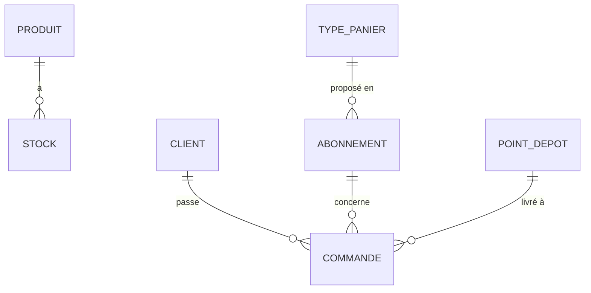

# Modèle de données — v1

Vocabulaire du cahier des charges : « Client » = celui qui achète, « Adhérent » = adhésion à l'association uniquement.

| Entité | Champs |
|---|---|
| Produit | nom, unite (pièce, kg, botte…), prixUnitaire |
| Stock | produit, mois, quantite |
| TypePanier | nom, valeurCible, actif |
| Abonnement | typePanier, frequence (hebdo, 2 semaines, mois), prix |
| PointDepot | nom, adresse, categorie (public, réservé, pro), capaciteMax, joursLivraison, creneauxRecuperation |
| Client | nom, prenom, email |
| Commande | client, abonnement, pointDepot, dateDebut, statut |
